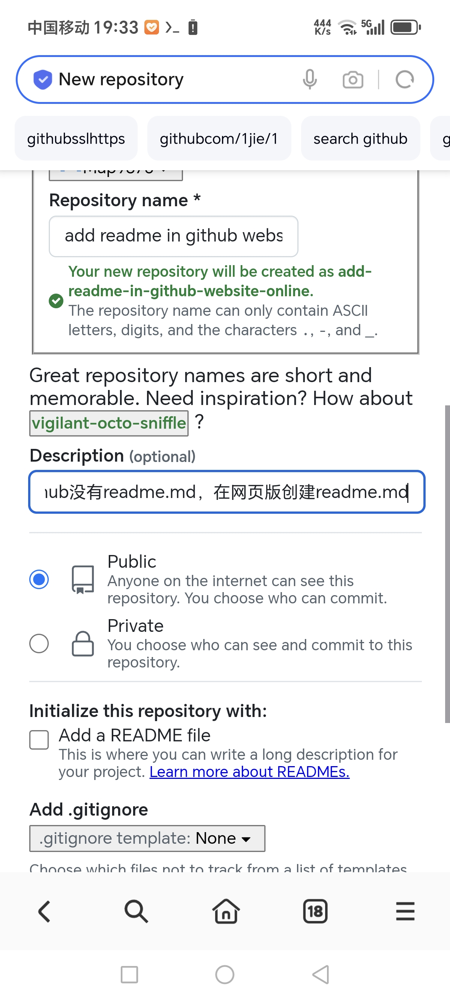
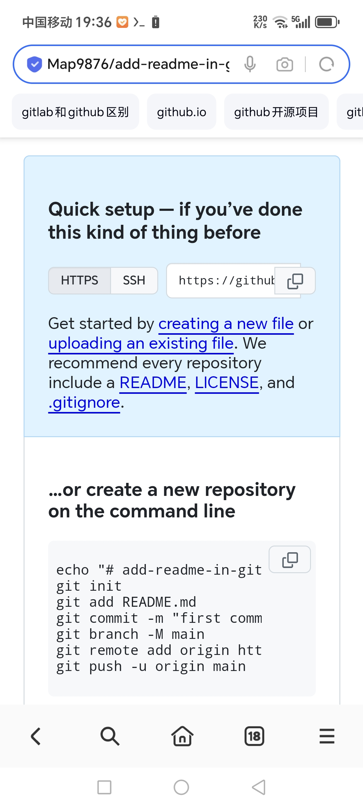
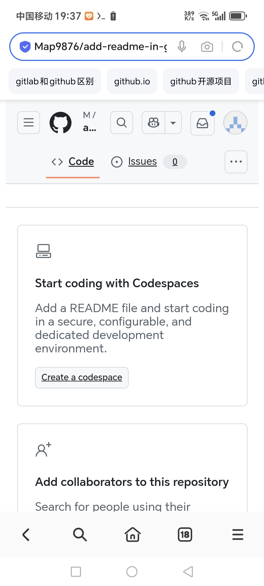
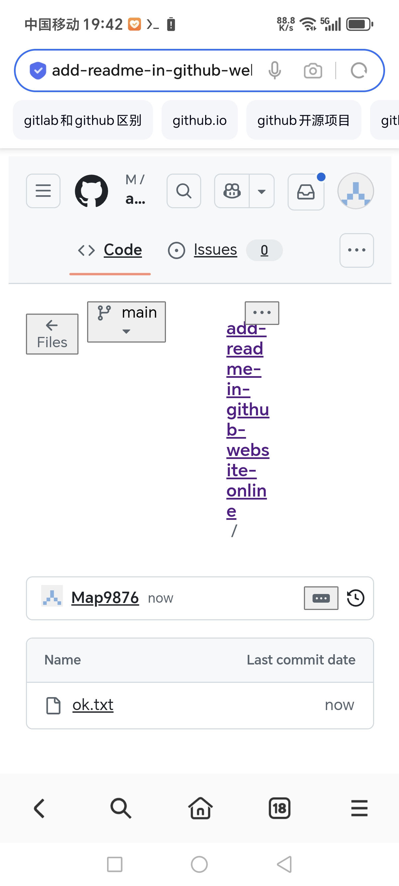
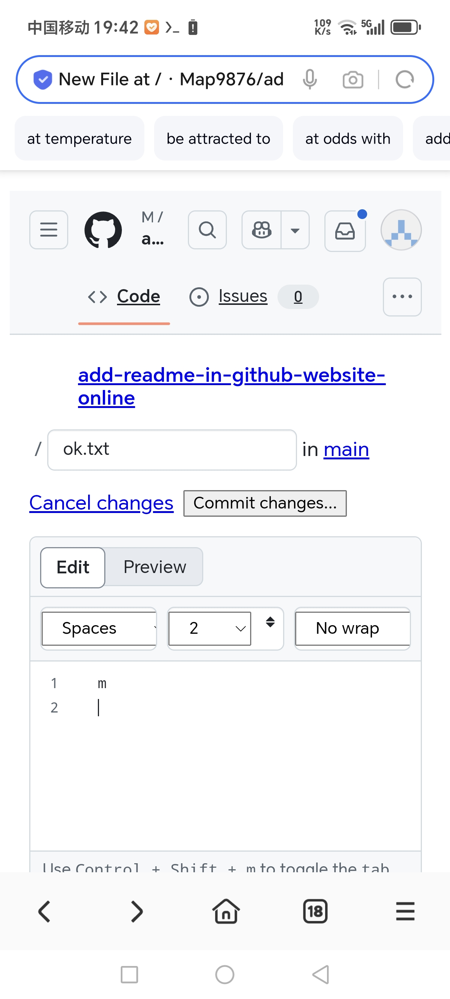
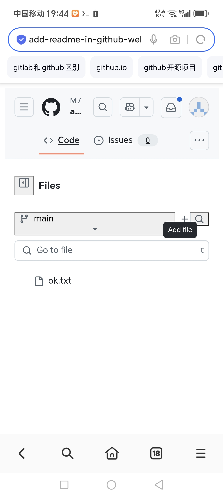
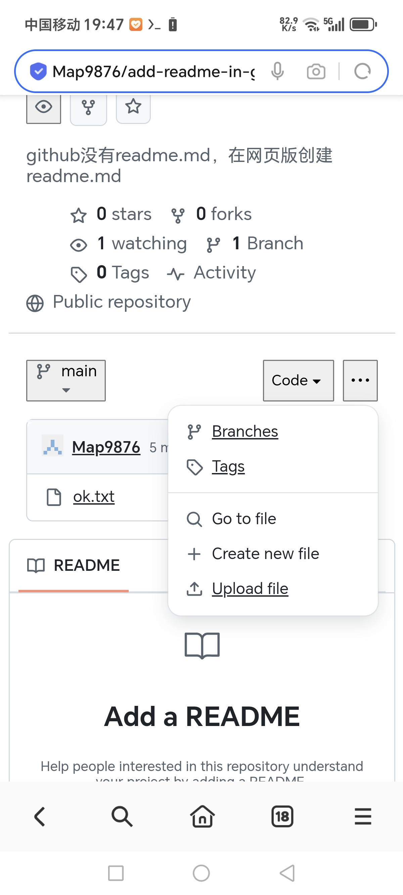
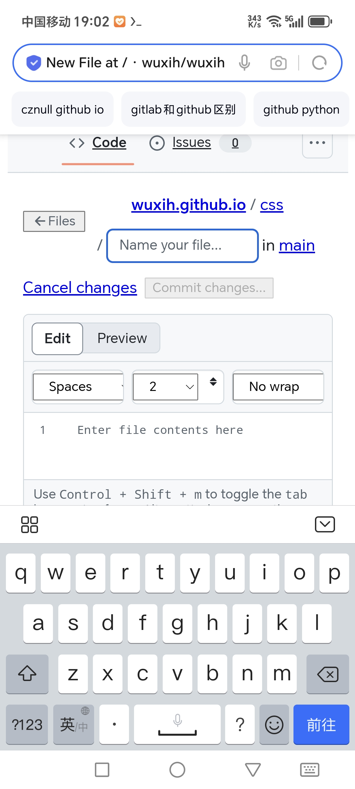

有时候创建储存库，没有创建add a readme file，要么按照提示：

```
echo "# add-readme-in-github-website-online" >> README.md
git init
git add README.md
git commit -m "first commit"
git branch -M main
git remote add origin https://github.com/Map9876/add-readme-in-github-website-online.git
git push -u origin main
```


手动去命令行提交commit，上传第一个文件


在浏览器，有以下两种创建readme.md方法：

1.  此时可以点击
Start coding with Codespaces下 Create a codespace这个按钮，也会自动创建一个readme.md文件


2.  

对于储存库 

https://github.com/Map9876/add-readme-in-github-website-online

可以打开


https://github.com/用户名/储存库名字/new/main

也就是

https://github.com/Map9876/add-readme-in-github-website-online/new/main

这样创建一个文件之后，就能看到正常储存库的文件页面，也能把代码新建复制上去




这个 `https://github.com/用户名/储存库名字/new/main` 新建文件的通用链接，也是从新建文件的通用页面链接复制出来

如上图，在点击去项目文件夹，或者文件后，左边files能显示一列文件列表，那个+号是创建新文件。


同时在项目主页右侧，下载压缩包链接的旁边，点击省略号，Create new file 也是创建新文件的地方：


### 创建新的文件夹：
css/ok.css直接输入，在输入css/的时候，显示正在编辑的路径，就会变成css/，相当于css/ok.css是创建文件夹+创建文件


```shell
https://github.com/copilot/c/ca4408bc-2a3c-430b-8c29-14373edf74f3 termux输出让ai换行

~ $ cd /storage/emulated/0/k/
.../0/k $ git init
hint: Using 'master' as the name for the initial branch. This default branch name
hint: is subject to change. To configure the initial branch name to use in all
hint: of your new repositories, which will suppress this warning, call:
hint:
hint:   git config --global init.defaultBranch <name>
hint:
hint: Names commonly chosen instead of 'master' are 'main', 'trunk' and
hint: 'development'. The just-created branch can be renamed via this command:
hint:
hint:   git branch -m <name>
Initialized empty Git repository in /storage/emulated/0/k/.git/
.../0/k $ git add .
fatal: detected dubious ownership in repository at '/storage/emulated/0/k'
To add an exception for this directory, call:
git config --global --add safe.directory /storage/emulated/0/k
.../0/k $ git config --global --add safe.directory /storage/emulated/0/k
.../0/k $ git add .
.../0/k $ git commit -m "first commit"
[master (root-commit) 76281c7] first commit
10 files changed, 82 insertions(+)
create mode 100644 README.md
create mode 100644 Screenshot_20250118_190205_com_hihonor_baidu_browser_LightSearchActivity.jpg
create mode 100644 Screenshot_20250118_193332_com_hihonor_baidu_browser_LightSearchActivity.jpg
create mode 100644 Screenshot_20250118_193626_com_hihonor_baidu_browser_LightSearchActivity.jpg
create mode 100644 Screenshot_20250118_193743_com_hihonor_baidu_browser_LightSearchActivity.jpg
create mode 100644 Screenshot_20250118_194214_com_hihonor_baidu_browser_LightSearchActivity.jpg
create mode 100644 Screenshot_20250118_194224_com_hihonor_baidu_browser_LightSearchActivity.jpg
create mode 100644 Screenshot_20250118_194448_com_hihonor_baidu_browser_LightSearchActivity.jpg
create mode 100644 Screenshot_20250118_194753_com_hihonor_baidu_browser_LightSearchActivity.jpg
create mode 100644 exiftool.py
.../0/k $ git branch -M main
.../0/k $ git remote add origin https://github.com/Map9876/add-readme-in-github-website-online.git
.../0/k $ git push -u origin main
Username for 'https://github.com':
Password for 'https://github.com':
remote: No anonymous write access.
fatal: Authentication failed for 'https://github.com/Map9876/add-readme-in-github-website-online.git/'
.../0/k $ cd
~ $
~ $ cd k
~/k $
~/k $ git push -u origin main
Username for 'https://github.com': j
Password for 'https://j@github.com':
remote: Support for password authentication was removed on August 13, 2021.
remote: Please see https://docs.github.com/get-started/getting-started-with-git/about-remote-repositories#cloning-with-https-urls for information on currently recommended modes of authentication.
fatal: Authentication failed for 'https://github.com/Map9876/add-readme-in-github-website-online.git/'
~/k $ ssh git@github.com
PTY allocation request failed on channel 0
Hi Map9876! You've successfully authenticated, but GitHub does not provide shell access.
Connection to github.com closed.
~/k $ git push -u origin main
Username for 'https://github.com': ^C
~/k $
~/k $ git remote add origin git@github.com/Map9876/add-readme-in-github-website-online.git
error: remote origin already exists.
~/k $ git remote set-url origin git@github.com/Map9876/add-readme-in-github-website-online.git
~/k $ git push -u origin main
fatal: 'git@github.com/Map9876/add-readme-in-github-website-online.git' does not appear to be a git repository
fatal: Could not read from remote repository.
Please make sure you have the correct access rights
and the repository exists.
~/k $ git remote set-url origin git@github.com：Map9876/add-readme-in-github-website-online.git
~/k $ git remote set-url origin git@github.com:Map9876/add-readme-in-github-website-online.git
~/k $ git push -u origin main
To github.com:Map9876/add-readme-in-github-website-online.git
! [rejected] main -> main (fetch first)
error: failed to push some refs to 'github.com:Map9876/add-readme-in-github-website-online.git'
hint: Updates were rejected because the remote contains work that you do not
hint: have locally. This is usually caused by another repository pushing to
hint: the same ref. If you want to integrate the remote changes, use
hint: 'git pull' before pushing again.
hint: See the 'Note about fast-forwards' in 'git push --help' for details.
~/k $ git puoo
git: 'puoo' is not a git command. See 'git --help'.
The most similar commands are
pull
push
~/k $ git pull
remote: Enumerating objects: 3, done.
remote: Counting objects: 100% (3/3), done.
remote: Total 3 (delta 0), reused 0 (delta 0), pack-reused 0 (from 0)
Unpacking objects: 100% (3/3), 842 bytes | 105.00 KiB/s, done.
From github.com:Map9876/add-readme-in-github-website-online
* [new branch] main -> origin/main
There is no tracking information for the current branch.
Please specify which branch you want to merge with.
See git-pull(1) for details.
git pull <remote> <branch>
If you wish to set tracking information for this branch you can do so with:
git branch --set-upstream-to=origin/<branch> main
~/k $ git push -u origin main
To github.com:Map9876/add-readme-in-github-website-online.git
! [rejected] main -> main (non-fast-forward)
error: failed to push some refs to 'github.com:Map9876/add-readme-in-github-website-online.git'
hint: Updates were rejected because the tip of your current branch is behind
hint: its remote counterpart. If you want to integrate the remote changes,
hint: use 'git pull' before pushing again.
hint: See the 'Note about fast-forwards' in 'git push --help' for details.
~/k $ git pull origin main
From github.com:Map9876/add-readme-in-github-website-online
* branch            main       -> FETCH_HEAD
hint: You have divergent branches and need to specify how to reconcile them.
hint: You can do so by running one of the following commands sometime before
hint: your next pull:
hint:
hint:   git config pull.rebase false  # merge
hint:   git config pull.rebase true   # rebase
hint:   git config pull.ff only       # fast-forward only
hint:
hint: You can replace "git config" with "git config --global" to set a default
hint: preference for all repositories. You can also pass --rebase, --no-rebase,
hint: or --ff-only on the command line to override the configured default per
hint: invocation.
fatal: Need to specify how to reconcile divergent branches.
~/k $ git push -u origin main
To github.com:Map9876/add-readme-in-github-website-online.git
! [rejected] main -> main (non-fast-forward)
error: failed to push some refs to 'github.com:Map9876/add-readme-in-github-website-online.git'
hint: Updates were rejected because the tip of your current branch is behind
hint: its remote counterpart. If you want to integrate the remote changes,
hint: use 'git pull' before pushing again.
hint: See the 'Note about fast-forwards' in 'git push --help' for details.
```

```
~/k $ ssh git@github.com
PTY allocation request failed on channel 0
Hi Map9876! You've successfully authenticated, but GitHub does not provide shell access.
Connection to github.com closed.
明明有连接但是
git remote add origin https://github.com/Map9876/add-readme-in-github-website-online.git
之后上传文件还是需要用户名
~/k $ git push -u origin main
Username for 'https://github.com': j
Password for 'https://j@github.com':
remote: Support for password authentication was removed on August 13, 2021.
remote: Please see https://docs.github.com/get-started/getting-started-with-git/about-remote-repositories#cloning-with-https-urls for information on currently recommended modes of authentication.
fatal: Authentication failed for 'https://github.com/Map9876/add-readme-in-github-website-online.git/'

解决办法：
如果用ssh-keygen 生成，填写码到github上，链接
应该使用 
git remote add origin git@github.com/Map9876/add-readme-in-github-website-online.git
而不是
git remote add origin https://github.com/Map9876/add-readme-in-github-website-online.git
第二种是使用token链接的

参考：搜索Username for 'https://github.com':已经有ssh
得到
https://github.com/orgs/community/discussions/23171
“
An HTTPS URL like https://github.com/user/repo.git
An SSH URL, like git@github.com:user/repo.git
”
问题是如果已经设置了一次，再设置，会有下面报错：
~/k $ git remote add origin git@github.com/Map9876/add-readme-in-github-website-online.git
error: remote origin already exists.
需要使用：
~/k $ git remote set-url origin git@github.com/Map9876/add-readme-in-github-website-online.git

```

 "修改文件后，再次提交需要git add .然后git commit -m"